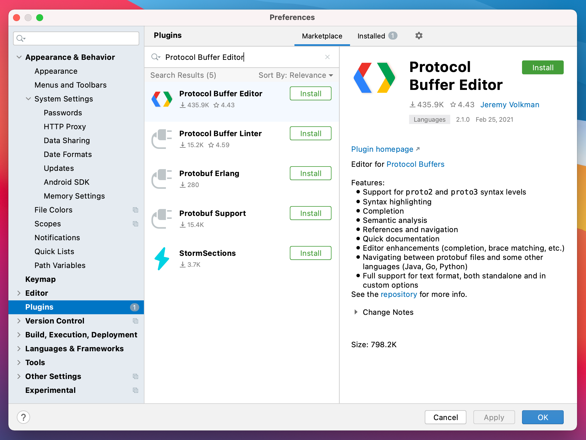
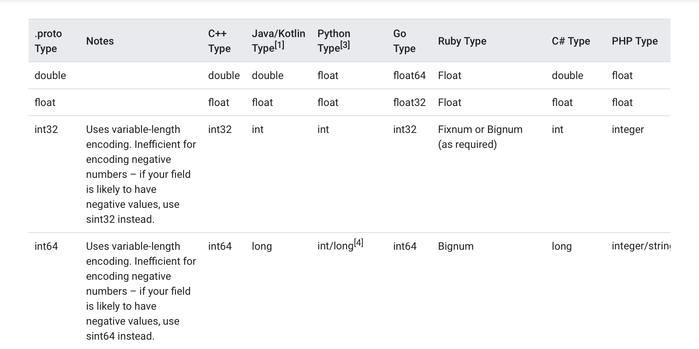

In a [previous post](https://yalematta.dev/blog/preferences-datastore.html) we have explored how to use **Preferences DataStore** to migrate our **SharedPreferences**. And in this post we will focus on **Proto DataStore**.

## What makes **Proto DataStore** different? 🤔

While both **Preferences** and **Proto DataStore** allow saving data, they do this in different ways. One important feature is applied only when using **Proto DataStore**, and it is **Type Safety**. 

With **Proto DataStore** we don't have to use keys. Instead we define a schema using Protocol Buffers. And with Protocol Buffers we can persist **strongly typed data**.

One of the downsides of **SharedPreferences** and **Preferences DataStore** is that there is no way to ensure that keys are accessed with the correct type. Using **Proto DataStore**, we know what types are stored and we will just provide them.

## What's Protocol Buffers? 🔍

Protocol Buffers were developed by Google for storing and interchanging all kinds of structured information. They are used for **serializing structured data**. It is similar to XML and other similar data formats, but **it's smaller, faster and simpler**.

If you don't know what serialization is, it's the process of translating a data structure or object state into a format that can be stored, like for example, a file or a memory data buffer.

### How Protocol Buffers work?👷🏻

We need to define how we want our data to be structured once, and the compiler will generate the source code for us to easily read and write the structured data. 

That said, with **Proto Datastore** we will serialize and save our custom data structure using Protocol Buffers and of course deserialize and read the values whenever we need to.

### Let's dive 🤿

In this simple [project](https://github.com/yalematta/datastore-demo), we are implementing the same _**Remember Me**_ functionality as in the previous post. We are currently using **SharedPreferences** to store this value and redirect the user to the Welcome screen once it's checked. We will migrate the code to use **Proto DataStore**.

 

To get your hands on the code, consider checking this [GitHub repo](https://github.com/yalematta/datastore-demo).  
The final code is located in the [_proto_datastore_](https://github.com/yalematta/datastore-demo/tree/proto_datastore) branch.

## Define Protobuf schema 🏷️

In order to use **Proto Datastore** we will need to define our Protobuf schema in a new `.proto` file. So instead of creating a model class in Kotlin, we will define it in a Protobuf schema instead. And there's a **new syntax** that we need to follow when writing this schema.

We will install a plugin in Android Studio called **Protocol Buffer Editor** that will help us write the Proto file. Make sure to install it before creating your proto files.

 

Once installed, we switch to our **Project View** and under **`app/src/main`** we create a new directory called **proto**. Inside this directory we create a new file **`user_prefs.proto`** where we define our Protocol Buffer schema as follows:

Let me walk you through this syntax:

### 1️⃣ Syntax

There are 2 versions for the Protobuff syntax: proto2 and proto3. You can check the [documention](https://developers.google.com/protocol-buffers/docs/proto3) for more info regarding these two different versions. In our case, we are going to use **proto3**.

### 2️⃣ Options

Then, we are going to write 2 options:
First, our **`java_package`** name. We need it in order to tell our compiler where to generate our classes from this protocol buffer. 
The second option is **`java_multiple_files`**. We will set it to true and this means that we need to create a separate file for each top level **message** object of this proto file.

### 3️⃣ Message

The **message** keyword defines the data structure. And inside it, we define the members of this structure. As you may have noticed we have different primitive types  in this syntax. 

 

By taking a look at the [documentation](https://developers.google.com/protocol-buffers/docs/proto3), we can learn that: int32 in Java represents an Integer, int64 a Long and bool is a Boolean.

We create an object **UserPreferences** with 2 member fields: a bool, a string and an int32. Don't be confused when you see these 1, 2 and 3. These are not actual values but unique numbers to identify our fields in the _message binary format_ and they **should not be changed** once our message object is in use.

## Dependencies 🔌

Before we continue let's place this **plugin** at the top of our build.gradle file.

Then we need to add two dependencies, one for Protobuf and one for Proto DataStore.

And finally at the end of our build.gradle file we configure Protobuf and we **sync our project**.

Now that we have added this plugin, we should be able to see the automatically generated files by this plugin from our **`user_prefs.proto`** file. 

Rebuild the project to see those files inside the java (generated) folder. 

We find a new **UserPrefs** folder that represents our proto file,  and a **UserPreferences** class that represents our message object. Inside it we have java code that implements some getters and setters for this UserPreferences message object.

## Serializer ↪️

To tell DataStore how to read and write the data type we defined in the proto file, we need to implement a Serializer. The Serializer defines also the default value to be returned if there's no data saved yet.

Back in our project, we create a class called **UserPreferencesSerializer** which extends Serializer<UserPreferences>. We implement its two methods readFrom and writeTo. In these methods we define how we want to read and write this object into our DataStore.

## DataStore Repository 🗃️

Next we create our Repository which we call **UserPreferencesRepository**.

### Read from DataStore 📋

We create a new variable called userPreferencesFlow of type Flow<UserPreferences>. We use our dataStore to read the data and catch exceptions if there is any and emit the default instance of UserPreferences in that case.

### Write to DataStore 📝

We create the suspend updateUsername function which will update one field from our UserPreferences member values. We will call **`preference.toBuilder().`** and we choose the setter method that we need from our generated class.

P.S: Don't forget to create a method to update each field.

### Clear DataStore 🆑

To clear data, we can either clear the preferences all together or clear a specific preference by its method from our generated class.

## Call it from the ViewModel 🤙🏼

In our **LoginViewModel**, we create a variable for our **UserPreferences**, read its data from our DataStore as a Flow and then convert it to LiveData.

Next we create a new function named **saveUserPreferences** and we pass to it the values that we want to update. We call viewModel scope and run the following code inside a coroutine since our update functions in our Repository are using Kotlin Coroutines.

**LoginViewModelFactory** is a ViewModelProvider.Factory that is responsible to create our instance of **LoginViewModel** later in our Activity. We will pass to it the **DataStoreRepository** which is need in **LoginViewModel**'s constructor.

## Observe it in the Activity 🔬

### Create DataStore 🗄️

In our Activity, we first create our userPreferencesDataStore and we initialize it and pass to it a file name as well as our Serializer class. 

### Migrate from SharedPreferences 📦

If we are migrating our existing data from the SharedPreferences, when creating our DataStore, we should add a migration based on the SharedPreferences name. 

And when creating the dataStore we need to update the DataStore builder and assign to the migrations parameter a new list that contains an instance of our SharedPreferencesMigration.

Define the mapping logic from SharedPreferences to UserPreferences inside your SharedPreferencesMigration.

DataStore will be able to migrate from SharedPreferences to DataStore automatically, for us. 

Inside our onCreate function, we initialize our ViewModel and we observe our fields' values, so that whenever this data changes we will update it in its corresponding text field. 

And whenever we click our login button, we store the value from our editText and checkBox field and update it in our DataStore using the saveUserPreferences function.

## Key Takeaways 💡

Now that we migrated to Preferences DataStore let's recap! 

**DataStore**:
- is a replacement for SharedPreferences
- has a fully asynchronous API using Kotlin coroutines and Flow
- guarantees data consistency
- handles data migration
- handles data corruption

DataStore has 2 different implementations: Preferences DataStore and Proto DataStore.

[**Preferences DataStore**](https://yalematta.dev/blog/preferences-datastore.html):
- stores and accesses data using keys

**Proto DataStore**:
- ensures Type Safety
- requires defining a schema using Protocol Buffers

## Up next ⏭

If this post was of any help to you, or if you'd like me to write about any specific Android related topics, let me know! Drop me a DM on Twitter [@yalematta](https://twitter.com/yalematta) ✌🏼