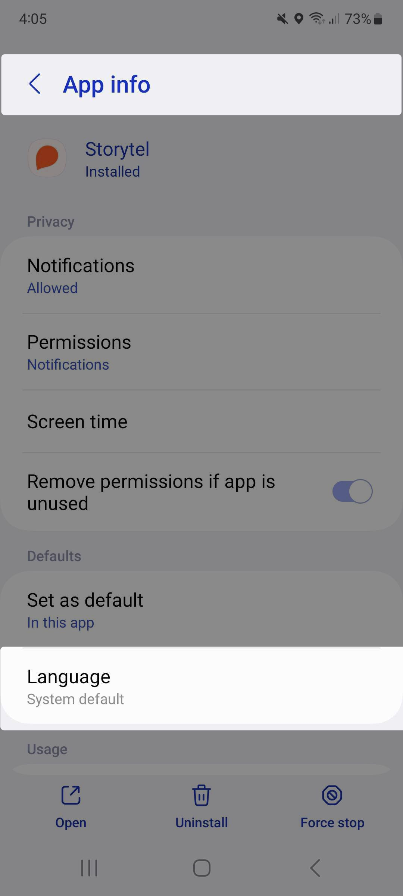

[Android 13](https://www.android.com/android-13/) has introduced a new feature that let you assign a different language to individual applications, allowing you to navigate each app with a specific language without the need to change the Language settings on my whole Android device.

## 📱 Try it on your device 

Navigate to your System settings: Settings > System > Languages & Input > App Languages. Select an app and then choose a specific language for it.
Or you can navigate to your Apps settings: Settings > Apps. Select an app, then under Language you can also choose a specific language for it.

## 📋 Add it to your App 

If your app supports different languages, you're ready to implement this feature. Otherwise, look into [localizing your Android app](https://developer.android.com/guide/topics/resources/localization) first, because adding per-app language settings to your app doesn't translate your app's resources automatically.

Implementing this feature in your app requires 3 simple steps: 

### 1️⃣ Add your app's supported languages to the System Settings

Create a file called `res/xml/locales_config.xml`. This [Sample file](https://developer.android.com/guide/topics/resources/app-languages#sample-config) will help you construct yours. Make sure to only have your localized languages specified there. Otherwise selecting a language that's not supported by your app will fall back to the default language, which is the locale specified in `res/values/strings.xml`

### 2️⃣ Edit the Manifest

In the manifest, add a line that points to this new file as follows:

### 3️⃣ Add your supported languages in Gradle

Use the `resourceConfiguration` property in your app's module-level `build.gradle` file to specify the same languages. As long as the `resourceConfigurations` property is present, the build system will only include these specified languages in the APK, avoiding the inclusion of translated strings from libraries that may support languages other than the ones your app supports. 

## 🎉 And you're done!

To test how this feature looks on your app: navigate to your app's info, find the Language section, change the Language of your app and check if it shows the correct language.

  

## ⏭ Up next 

If this post was of any help to you, or if you'd like me to write about any specific Android related topics, let me know! Drop me a DM on Twitter [@yalematta](https://twitter.com/yalematta) ✌🏼
